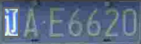

## TextScanner
>Implementation of [TextScanner](https://arxiv.org/abs/1912.12422) with pytroch
>We trained this model on license plate number dataset([CCPD](https://github.com/detectRecog/CCPD)).
### Usage
   - dataset prepare
     > prepare the training dataset as the 'data' directory  
   - train
     > execute the 'scripts/train.sh'
   - test
     > execute the 'scripts/test.sh'
   - infer
     ```shell script
     python exp/infer.py --load_model_path checkpoints/txt_scan_res18_lr_1e-5_batch_16/best_val_error.pth
     ````
     
     
     
     
     
     
